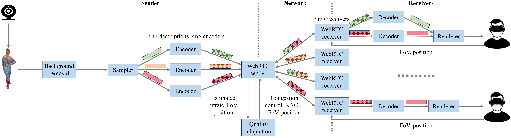

# One-to-many WebRTC-based point cloud video conferencing

In this repository, all files related to a one-to-many volumetric video-based system are made available. Three parts are considered:

- A [capturer](capturer) written in C++, use to capture point clouds and encode them using Draco
- A [Unity project](unity/spirit_o2m_webrtc) written in C#, used to render the point cloud video
- A [WebRTC client](webrtc-client) and a [WebRTC server](webrtc-server) written in Golang, containing the WebRTC server and client applications
- A [connector plugin](connector) written in C++, used to interconnect the Unity application to the WebRTC client

The system is currently under development by IDLab, Ghent University - imec. This README will be updated while development continues, with detailed instructions for each of these components.

## Architecture

The developed system supports one-to-many point cloud delivery using a multi-description coding (MDC) approach. In contrast to traditional approaches - which either compress point cloud frames as a whole or apply spatial segmentation in the form of tiles - our solution creates several distinct subsets (descriptions) of sampled points. Each of these descriptions can be encoded separately, resulting in lower processing times due to parallelization. Furthermore, multiple descriptions can be merged together after decoding, resulting in a representation of higher visual quality.



As shown in the above illustration, our solution provides a fixed number of encoders per participant, corresponding to the number of descriptions. The number of local decoders for each client scales with the number of received descriptions. The WebRTC server decides on what descriptions will be sent to each client, taking into account the user's field of view (FoV) and position in the sence, as well as the bandwidth that is available to the client (estimated through [Google congestion control](https://datatracker.ietf.org/doc/html/draft-ietf-rmcat-gcc-02)).

For a more detailed explanation of the system, we refer to our recent publication [1].

[1] M. De Fré, J. van der Hooft, T. Wauters, and F De Turck. "Scalable MDC-Based Volumetric Video Delivery for Real-Time One-to-Many WebRTC Conferencing", Proceedings of the 15th ACM Multimedia Systems Conference, 2024 (available [here](https://backoffice.biblio.ugent.be/download/01HW2J66EZD49XQD2P94JBXHKR/01HW2J8F937QNC36XHZEBRHE8K))

## Installation
What you need to build and install depends if you are the sender or receiver of the video. 

The following is required if you are the **sender**:
* [Capturing](#capturing)
* [WebRTC server](#webrtc-server-and-client)

The following is required if you are the **receiver**:
* [WebRTC client](#webrtc-server-and-client)
* [Unity application](#unity)
* [Unity WebRTC connector](#webrtc-connector)

> ❗ It is also best to install the latest version of [vcredist](https://learn.microsoft.com/en-us/cpp/windows/latest-supported-vc-redist?view=msvc-170#visual-studio-2015-2017-2019-and-2022) to prevent any problems.

### Capturing
Capturing is done with a separate [application](capturer). Currently the application only supports Intel Realsense cameras as a means to capture the point clouds. Make sure your system has the necessary libraries and drivers installed. If this is not the case follow the instructions below:

This project requires several dependencies for the capturing and preprocessing of the point clouds. You can either build and install these dependencies yourself (and make sure the Visual Studio project is able to find them) or if you have vcpkg all required dependencies will be automatically installed and build (currently this application uses PCL which takes significant time to build with vcpkg). Make sure to follow  [the guide](https://learn.microsoft.com/en-us/vcpkg/get_started/get-started-msbuild?pivots=shell-powershell). You can skip the steps that involve creating a new manifest file, or add new dependencies.

> ❗ Make sure to install `vcpkg` in a location that contains no spaces, if you do certain dependencies will break.

> 💡 If you get a build error you probably either skipped the `vcpkg integrate install` step or the step that sets the environment variables. If this happens you will need to `vcpkg integrate remove`, followed by `vcpkg integrate install` and by setting the environment variables. 

### WebRTC server and client
To build the WebRTC server and client you will need to make sure you have installed the [latest version of Golang](https://go.dev/doc/install). If this is the case you will be able to simply do `go build -o NAME.exe .` in the root to build the application. This process will automatically download any necessary  dependencies.

However, for the receiver you will to manually change the current version used by Unity. To do this you will have to the replace existing [webRTC-peer-win.exe](unity/spirit_o2m_webrtc/Assets/peer/) of the Unity application.

### Unity
First you will have to open the [unity](unity) folder of this repository in Unity hub. Doing so will automatically download any dependencies. Once inside you are able to build the application like any other Unity application, the scene you want to build is called `MainScene` and is located in `Assets/Scenes`.
> :warning: If you get a message asking you to convert to application to a newer Unity version, or to install the older version, always choose to install the older version. The application was not tested with never version of Unity, and problems will likely occur if you upgrade.
> :exclamation: When building the application, you will have to manually copy the `config` and `peer` directories from the `Assets` directory to the [Unity application datapath](https://docs.unity3d.com/ScriptReference/Application-dataPath.html) (In Windows this is: `spirit_unity_Data`).

### WebRTC Connector
The Unity application uses a Dll to connect to the Golang WebRTC application via sockets. Normally you should never have to build this yourself as this repository contains the latest version.

However, if you do plan to make changes to it, you will have to manually copy it into the `Plugins` directory after building it.

For more information about the Dll you can visit the [README](connector/README.md) of the WebRTC Connector.

## Usage

The first step is to make sure that an instance of the capturing application is started. In general, when you are using a camera, you can start the capturing with the following command:

```
./PCCapturer.exe -i -p PROXY_CONFIG_PATH -l layer
```

This will start a capturer (using an Intel Realsense camera) that uses the parameters in the [config file](capturer/config_example/proxy_config.json) to start the one-to-many WebRTC server. Additionally, it uses the MDC-based encoding for point clouds. You can find the information of the other optional parameters, and the config file, in the [capturer directory](capturer).

The Unity clients can be started once the capturer and server are fully running. For these you need to make sure that their configuration file has the correct parameters, and that it's placed in a `config` directory in the [Unity application datapath](https://docs.unity3d.com/ScriptReference/Application-dataPath.html). You can find an example config file [here](unity/spirit_o2m_webrtc/Assets/config/session_config.json). The most important parameter you will have to change is the `srvAddr`, which needs to be changed to the address of your WebRTC server. By default the server will be using `0.0.0.0:5678`

The other important parameters are the `selfPort` and `clientPort` these parameters determine which local ports will be used to communicate between Unity and the Golang WebRTC client application. You will only need to change this if you are planning to run multiple clients on the same machine.


## Supported HMDs
In general every OpenXR compatible headset will work. However, below is a list of all headsets that have been tested and verified:
#### Tested
- Meta Quest 2 ([guide](https://www.meta.com/en-gb/help/quest/articles/headsets-and-accessories/oculus-link/connect-with-air-link/))

## Potential Problems
If you are noticing packet loss (i.e. frames not being delivered), there is a high chance that this is related to your machine not being powerful enough to process the network buffer in time. You can solve this by increasing the default buffer as follows:

### Linux 
```
sudo sysctl -w net.core.rmem_max=<new_value>
sudo sysctl -w net.core.wmem_max=<new_value>
sudo sysctl -w net.core.rmem_default=<new_value>
sudo sysctl -w net.core.wmem_default=<new_value>
```
With `<new_value>` being a pretty high value such as `52428800`. If you want these changes to be permanent you will also have to add them to `/etc/sysctl.conf`.
### Windows
Open the Registry and go to `Computer\HKEY_LOCAL_MACHINE\SYSTEM\CurrentControlSet\Services\AFD\Parameters` Once you are here you will need to add `DefaultReceiveWindow` and `DefaultSendWindow` as `DWORD` with a high value (e.g. `2097152` for receive and `64512` for send).

## Funding

This work is funded by the European Union [SPIRIT project](https://www.spirit-project.eu), grant agreement 101070672.


